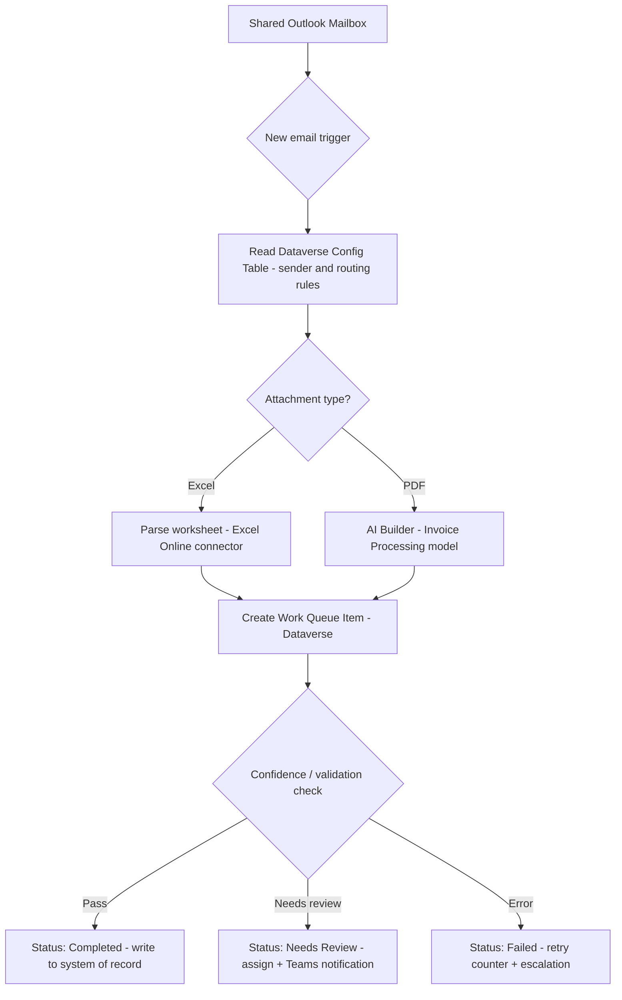

# Power Automate Cloud Flow — Outlook Invoice & Attachment Intake

A portfolio reference build showing how I design production-grade Power Automate cloud flows for unattended document intake: watch a shared mailbox, branch by attachment type, extract structured data with AI Builder, and track every item through a Dataverse-backed work queue with retries and human review.

Note: this repo documents the flow design and configuration approach used in client engagements (see my Upwork profile). It's a rebuilt reference version for demonstration purposes — sender names, invoice numbers and routing rules shown are sample data, not real client records.

## Problem

Finance and ops teams receive invoices and reports by email in mixed formats (Excel and PDF). Manually opening each attachment, keying values into a system of record, and chasing exceptions is slow and error-prone. This flow removes the manual triage step and gives every incoming item a tracked status.

## Architecture

## How it works

1. Trigger: "When a new email arrives" (shared mailbox connector), filtered to senders/subjects present in the Dataverse config table.
2. Config lookup: a Dataverse table (`cr_config_senders`) maps sender domain to a routing profile (department, default owner, SLA hours) so onboarding a new vendor is a data change, not a flow change.
3. Branch by attachment type using a Switch action on file extension.
4. Excel path: `List rows present in a table` / `Excel Online (Business)` parses the worksheet directly into rows.
5. PDF path: AI Builder's Invoice Processing prebuilt model extracts vendor, invoice number, date, line items and total; confidence score is captured per field.
6. Work queue: every item becomes a row in a Dataverse work queue table with `Status` (New / Processing / Needs Review / Completed / Failed), `RetryCount`, `AssignedTo` and `SourceEmailId` (for idempotency — re-processing the same email is a no-op).
7. Validation: line-item totals are cross-checked against the extracted invoice total; low-confidence or mismatched items are routed to Needs Review with a Teams adaptive card for a one-click approve/reject.
8. Failure handling: transient errors (throttling, connector timeouts) increment `RetryCount` and requeue up to 3 times before escalating.

## Dataverse work queue schema (reference)

| Column | Type | Purpose |
|---|---|---|
| SourceEmailId | Text | Idempotency key from the Outlook message ID |
| VendorName | Text | Extracted or looked up from config table |
| DocumentType | Choice | Excel / PDF |
| Status | Choice | New, Processing, Needs Review, Completed, Failed |
| ConfidenceScore | Decimal | AI Builder field confidence (PDF path only) |
| RetryCount | Whole Number | Incremented on transient failure |
| AssignedTo | Owner | Set when Status = Needs Review |
| ProcessedOn | DateTime | Set when Status = Completed |

## Tech stack

- Power Automate (cloud flow)
- AI Builder – Invoice Processing model
- Microsoft Dataverse (config table + work queue table)
- Outlook / Excel Online connectors
- Microsoft Teams (adaptive card notifications)

## Why this design

- Config-driven, not hardcoded – new senders or routing changes don't require touching the flow.
- Queue-based, not linear – every item has a durable status, so a flow failure mid-run never silently loses a document.
- Human-in-the-loop where it matters – low-confidence extractions go to a person instead of writing bad data downstream.

## About

Built by Poorani R., Power Automate / RPA developer. See more automation projects on my [Upwork profile](https://www.upwork.com/freelancers/~017d8cafb3f856e3f4) and other repos in this GitHub profile.
